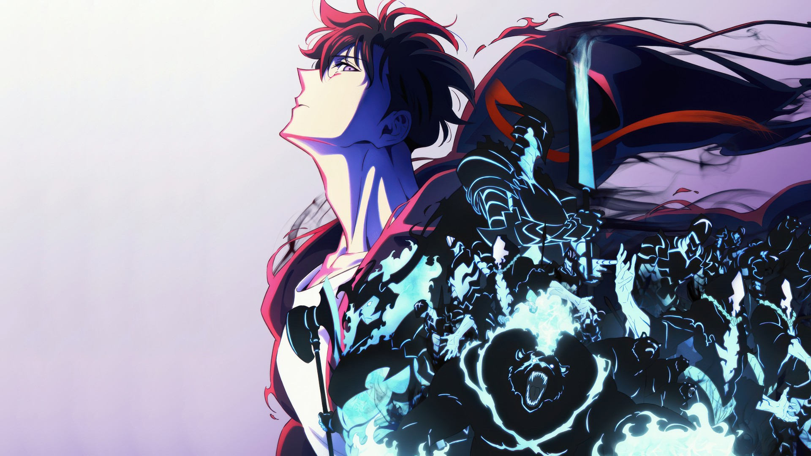

# 🌌 Solo Leveling - Fanpage

Projeto de uma landing page dedicada ao anime **Solo Leveling**, desenvolvido com foco em responsividade, animações suaves e um layout inspirado nas plataformas de streaming como a Netflix.

🔗 [Acesse o site aqui](https://miguelhttp.github.io/website-solo-leveling/)

## 🛠️ Tecnologias Utilizadas

- **HTML5**
- **CSS3**
- **JavaScript**
- **Responsividade com Media Queries**
- **Google Fonts**
- **Deploy via GitHub Pages**

## 📸 Demonstração



## 🎯 Funcionalidades

- Layout responsivo
- Banner com imagem de destaque e botão animado
- Seção "Sobre" com descrição e gêneros
- Galeria de imagens com efeito hover
- Footer com links úteis
- Navegação com menu adaptado para dispositivos móveis
- Efeitos de blur e gradiente entre seções

## 🧠 Aprendizados

Durante o desenvolvimento, aprofundei conhecimentos sobre:

- Planejamento de layout e seções
- Gradientes e efeitos visuais com CSS
- Uso de `backdrop-filter` para efeitos de blur
- Media queries para responsividade
- Deploy com GitHub Pages

## 🚀 Como rodar localmente

```bash
# Clone o repositório
git clone https://github.com/miguelhttp/website-solo-leveling.git

# Acesse a pasta do projeto
cd website-solo-leveling

# Abra o arquivo index.html no navegador
